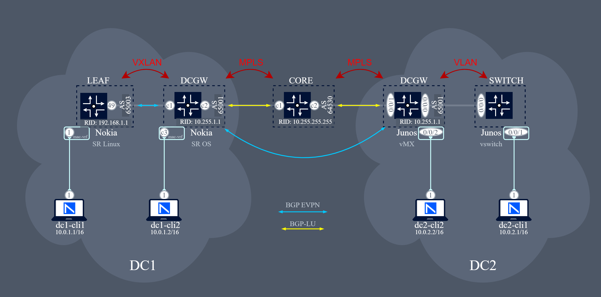

# EVPN-MPLS Datacenter Interconnect (DCI)
Containerlab topology demonstrating EVPN-MPLS Datacenter Interconnect (DCI) between a **Nokia SR OS** DC Gateway, and **Nokia SR Linux** VXLAN leaf switches and **Juniper vMX**. The lab showcases labeled BGP sessions, EVPN route exchange, and seamless VXLAN–MPLS integration.



## Deploying the lab
Start with cloning the repository:

```bash
git clone https://github.com/michelredondo/evpn-mpls-vxlan-dci-lab.git && cd evpn-mpls-vxlan-dci-lab
```
The lab is deployed with [containerlab](https://containerlab.dev) project where [`evpn-mpls-vxlan-dci-lab.clab.yaml`](evpn-mpls-vxlan-dci-lab.clab.yaml) file declaratively describes the lab topology.

```bash
# deploy the lab
containerlab deploy 
```

Once the lab is completed, it can be removed with the destroy command.

```bash
# destroy the lab
containerlab destroy 
```
## Accessing the network elements
After deploying the lab, the nodes will be accessible. To access a network element, simply use its hostname as described in the table displayed after execution of the deploy command.
```
ssh admin@clab-dci-lab-dc1-srl-leaf1
ssh admin@clab-dci-lab-dc1-sros-dcgw1
ssh admin@clab-dci-lab-dc2-junos-dcgw1
ssh admin@clab-dci-lab-dc2-junos-switch1
```

The Linux CE clients don't have SSH enabled. In order to access them, use `docker exec`.
```
docker exec -it clab-dci-lab-dc1-cli1 bash
```

## Configuration
All nodes come preconfigured thanks to startup-config setting in the topology file [`evpn-mpls-vxlan-dci-lab.clab.yaml`](evpn-mpls-vxlan-dci-lab.clab.yaml). Those configuration files can be found in [`configs`](/configs). 